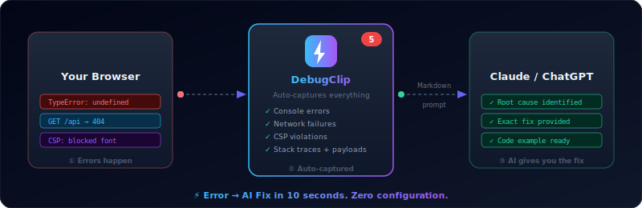
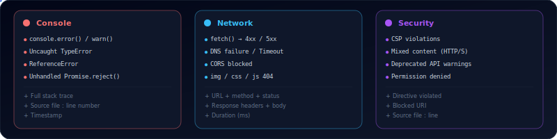

  

  
  
  
  
  

<h3 align="center">
  Stop copy-pasting errors into ChatGPT. 
  DebugClip captures them and sends them for you.
</h3>

  <em>A Chrome extension that captures everything you see in DevTools — 
  console errors, network failures, CSP violations — and delivers them 
  to Claude or ChatGPT as a perfectly formatted prompt. One click.</em>

---

## 🎬 See It In Action

  

---

## 💡 What It Does

> **You:** See an error in the browser  
> **Old way:** Open DevTools → find error → copy → switch to AI → paste → add context → wait → switch back. **5-10 min per bug.**  
> **DebugClip:** Click the icon → all errors are there → click "Send to Claude" → done. **10 seconds.**

DebugClip is a **capture + format + deliver** tool. It doesn't run AI itself — it makes your existing AI tools 10x more effective by giving them perfect context.

---

## ⚡ What Gets Captured

| Category | What's Detected |
|----------|----------------|
| **Console** | `console.error()`, `console.warn()`, uncaught `TypeError`, `ReferenceError`, unhandled Promise rejections |
| **Network** | Failed `fetch()` (4xx, 5xx), network timeouts, DNS failures, CORS blocks, XHR errors |
| **Resources** | Broken images, missing stylesheets, failed script loads (404, DNS) |
| **Security** | CSP violations, mixed content warnings, deprecated API notices |

All captured data includes **timestamps, stack traces, request/response headers, and body payloads** — everything an AI needs to diagnose the issue.

---

## 🔑 Key Features

- 🔴 **Live badge counter** — see error count on the icon without opening anything
- 📋 **Structured Markdown prompts** — token-optimized for Claude & ChatGPT
- ⚡ **One-click send** — opens AI tab with the prompt ready (Pro: auto-paste)
- 🌍 **Works on any site** — localhost, staging, production, any framework
- 🛡️ **Zero data collection** — everything stays in your browser, period
- 🔧 **No config needed** — install and it just works

---

## 📦 Install

  

Or visit **[debugclip.io](https://debugclip.io)** for more info.

---

## 🏗️ How It Works

> No configuration. No setup. Install → browse → errors captured → send to AI.

  

<em>Less noise, more clarity. DebugClip surfaces what matters — without you opening DevTools.</em>

---

## ⚡ What Gets Captured

> Everything you see in Chrome DevTools — without opening Chrome DevTools.

  

All captured data includes **timestamps, stack traces, request/response headers, and body payloads** — the full context an AI needs to diagnose any issue instantly.

---

## 💰 Pricing

| | Free | Pro ($4 one-time) |
|---|---|---|
| Error & network capture | ✅ | ✅ |
| Badge counter | ✅ | ✅ |
| Copy prompt to clipboard | ✅ | ✅ |
| Claude & ChatGPT support | ✅ | ✅ |
| **Auto-inject into AI tab** | ❌ | ✅ |
| **Custom prompt templates** | ❌ | ✅ |
| **Session history** | ❌ | ✅ |
| **LocalStorage snapshots** | ❌ | ✅ |

---

## 🔒 Privacy

- ✅ No data collection — zero telemetry, zero tracking
- ✅ All processing is local — errors never leave your browser
- ✅ BYOK model — your API keys stay on your device
- ✅ No external servers — the only network call is optional license validation
- ✅ Minimal permissions — only what's strictly necessary

Read the full [Privacy Policy](https://debugclip.io/privacy).

---

## 💖 Support the Project

DebugClip is built and maintained by an indie developer. If it saves you time:

  
  

---

## 🗺️ Roadmap

| Version | Features |
|---------|----------|
| 0.1.0 ✅ | Console + network + CSP capture, prompt compiler, badge, clipboard |
| 0.2.0 🚧 | Auto-refresh, search/filter, expand all |
| 0.3.0 📋 | Custom templates, session history |
| 1.0.0 📋 | Pro tier, license system, Web Store launch |
| 1.1.0 📋 | DOM snapshots, error grouping, performance metrics |

---

  Built with ⚡ by <a href="https://github.com/oussamazbair">Oussama Zbair</a>

