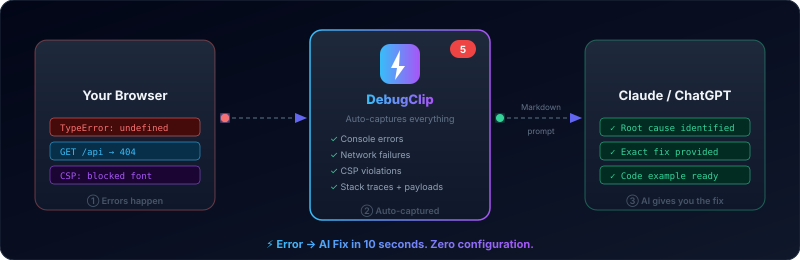
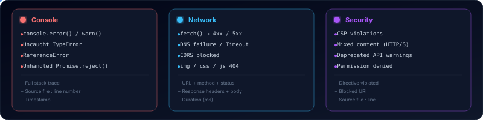

  

  
  
  
  

<h3 align="center">
  Capture browser errors. Send to AI. Get fixes.
</h3>

  <em>A Chrome & Edge extension that captures console errors, network failures, 
  and CSP violations — then formats them into structured prompts for 
  Claude, ChatGPT, Gemini, DeepSeek, or Copilot.</em>

---

## 🎬 Demo

  

---

## 💡 What It Does

> **Old way:** See error → open DevTools → copy → switch to AI → paste → add context. **5-10 min per bug.**  
> **DebugClip:** Click the icon → errors are there → send to AI. **10 seconds.**

---

## 🏗️ How It Works

  

---

## ⚡ What Gets Captured

  

---

## 🔑 Features

- 🔴 **Live badge counter** — error count on the icon
- 📝 **5 prompt templates** — Default, React, API, Minimal, Detailed
- 🤖 **5 LLM targets** — Claude, ChatGPT, Gemini, DeepSeek, Copilot
- 🚀 **Auto-inject** — pastes prompt directly into the AI input (Pro)
- 📜 **Session history** — persist captures across navigations (Pro)
- 🔇 **Smart filtering** — ignore noisy errors with regex rules (Pro)
- 🛡️ **Privacy-first** — zero data collection, everything local
- 🌍 **Any website** — localhost, staging, production

---

## 📦 Install

  
  

---

## 💰 Pricing

| | Free | Pro — $4 Lifetime | Ultimate — $19 Lifetime |
|---|---|---|---|
| Error & network capture | ✅ | ✅ | ✅ |
| Badge counter | ✅ | ✅ | ✅ |
| View captured errors | ✅ | ✅ | ✅ |
| Copy & send to LLM | 🔒 Preview only | ✅ Unlimited | ✅ Unlimited |
| Session history | ❌ | ✅ | ✅ |
| Smart filtering | ❌ | ✅ | ✅ |
| Custom templates | ❌ | ✅ | ✅ |
| AI response in popup (BYOK) | ❌ | ❌ | ✅ |
| VS Code extension | ❌ | ❌ | ✅ |
| MCP server for agents | ❌ | ❌ | ✅ |

---

## 🔒 Privacy

- ✅ Zero telemetry — no tracking, no analytics
- ✅ All processing local — errors never leave your browser
- ✅ No external servers — only call is optional license validation
- ✅ Minimal permissions — only what's strictly necessary

[Full Privacy Policy](https://debugclip.online/privacy) · [Terms of Service](https://debugclip.online/terms)

---

## 💖 Support

  
  

---

## 🗺️ Roadmap

| Version | Status | Features |
|---------|--------|----------|
| 0.1.0 | ✅ Released | Error capture, prompt compiler, badge, 5 templates, 5 LLMs |
| 0.2.0 | ✅ Released | Pro tier, session history, smart filtering, license system |
| 0.3.0 | 🚧 Building | Ultimate tier, BYOK AI response, gift licenses, referral program |
| 1.0.0 | 📋 Planned | VS Code extension, MCP server, webhooks |

